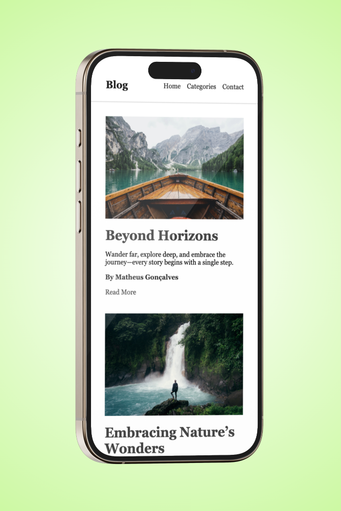
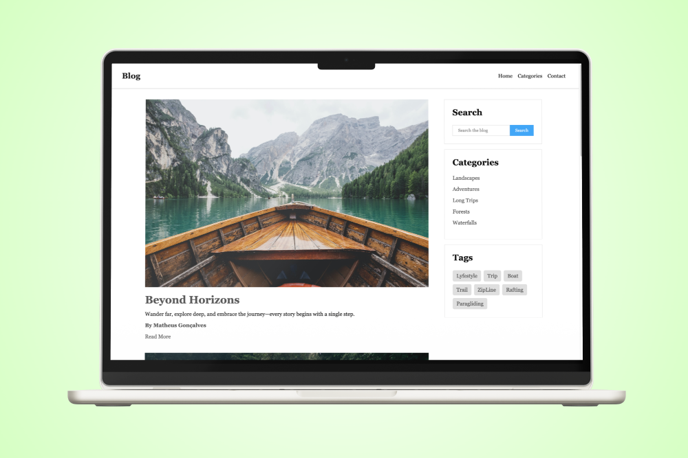

# Travel Blog Landing Page

This project is a landing page for a travel blog, designed to practice and demonstrate the use of semantic HTML5 tags. The goal is to create a well-structured and accessible webpage using elements like `<header>`, `<nav>`, `<footer>`, `<article>`, `<aside>`, and others.

## Features

- **Semantic HTML5 Structure**: The page is built using semantic HTML elements to improve accessibility and SEO.
- **Responsive Design**: The layout adapts to various screen sizes, providing a seamless experience on mobile, tablet, and desktop devices.
- **Engaging Visuals**: High-quality images that evoke the spirit of travel and adventure are integrated into the design.
- **Clear Navigation**: A simple and intuitive navigation menu allows users to explore different sections of the blog with ease.

## Project Structure

```
index.html    # Main HTML file
css/
  styles.css  # Main stylesheet for the project
img/       # Directory containing the images used in the project
```

## Getting Started

To view the landing page locally:

1. Clone the repository:
   ```bash
   git clone https://github.com/oftheus/Semantic-Blog.git
   ```

2. Open `index.html` in your web browser.

## Technologies Used

- **HTML5**: For structuring the content using semantic elements.
- **CSS3**: For styling the page and ensuring responsive design.

## Contributing

If you'd like to contribute or suggest improvements, feel free to open an issue or submit a pull request.



